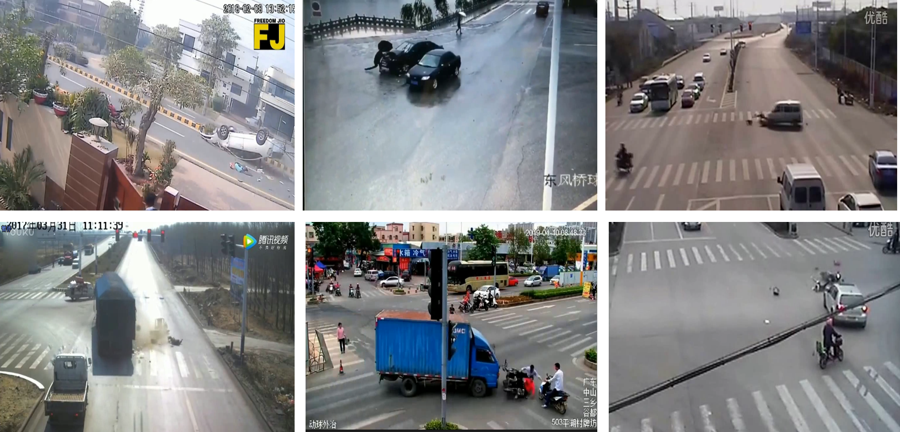

# Dataset_for_Crash_Detection

We open-sourced part of our crash dataset that involved no privacy (from Internet) 

### Simple Description

- The  dataset contains **1217 crash videos**  that involved no privacy (from Internet) 
- This dataset and its corresponding paper were submitted to **《*IEEE TRANSACTIONS ON INTELLIGENT TRANSPORTATION SYSTEMS*》**
  - **Paper name :《A Modified Two-stream Network for Vision-based Crash Detection: Improving the Accuracy in Congested Traffic》**
  - When accepted, welcome to **cite** our paper if it is helpful you!
  
### Some Crash Scenarios

### Some detection results

  

### Data Download

- We publicized 100 videos  for paper checking before published

  - sub-dataset for check  [[google drive](https://drive.google.com/file/d/1biUwx_d4QXTba8y0xtKlDABES2f2XSp1/view?usp=sharing)]  [[baiduNetdisk](https://pan.baidu.com/s/1bYhfRNEug5qHjenBQxv7-g 
) (提取码:tr2m)]

- Once the paper is accepted, we will make all the dataset public
  - all dataset and its annotation file  [[google drive](链接地址)]  [[baiduNetdisk](链接地址)] (Waiting for updating)

### Contact 

If you have any questions or want to add your results, please contact us in issues.
